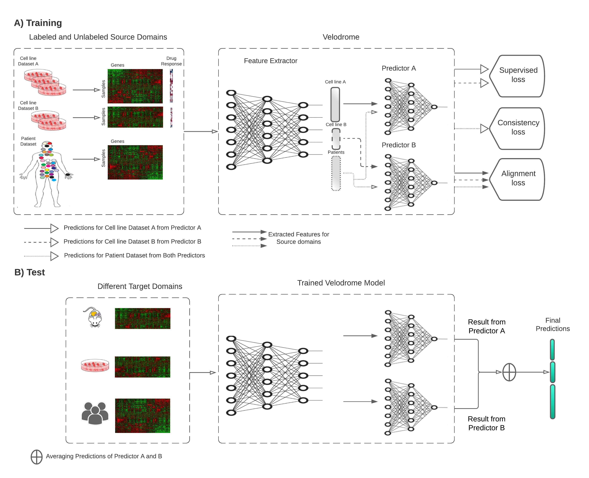

# Out-of-Distribution Generalization from Labeled and Unlabeled Gene Expression Data for Drug Response Prediction



[Paper](https://www.nature.com/articles/s42256-021-00408-w/)

[bioRxiv](https://www.biorxiv.org/content/10.1101/2021.05.25.445658v4)

# Table of contents
1. [Installation](#installation)
2. [Datasets](#Datasets)
3. [Experiments](#Experiments)
4. [Citation](#citation)


# Installation

## Requirements
- Python 3
- Conda
- The bash scripts are for Slurm cluster environments.

To get the source files of PGx Guidelines you need to clone into its repository:
```
git clone https://github.com/hosseinshn/Velodrome
```

### Conda environment
All the required packages to run PGx Guidelines experiments are specified in `environment` subdirectory.
To install these packages run the following command:
```
conda env create -f PGx.yml
```
This command installs `PGxG` environment. 

After the successful installation of the packages into environmet you would be able to load them using `conda activate`.


# Datasets

## Download datasets
All of the utilized datasets for Velodrome experiments are publicly available:
```
https://zenodo.org/record/4793442#.YK1HVqhKiUk
``` 
After downloading the datasets execute the following command in the main directory: 
```
mkdir Data
```
Then, move the downloaded datasets to this new directory. 

# Experiments
This section provides instructions to reproduce the reported experimnets.
It is important to note that Velodrome experiments are designed to be performed on CPU only and can be submitted to clusters.

```
mkdir logs
mkdir models
mkdir results
```
The path to these directories should be added to all running scripts. 

## Velodrome Train
To run the Velodrome training experiments, execute the following codes:
```
mkdir -p output_res
mkdir -p log_res
sbatch run_velodrome.bs
```
This script submits 600 jobs at the same time for training different hyper-parameter settings. 

### Output Files
The structure of an output directory (e.g. `Save50_65_0.3_0.001_0.0005_0.05_3_0.005_0.0001_0.0005_0.5_0.5`) after a successful run will be as follows:

```
cd results
cd DRUG_NAME
cd Save50_65_0.3_0.001_0.0005_0.05_3_0.005_0.0001_0.0005_0.5_0.5

├── args.txt            # Input arguments passed to Velodrome 
├── Best_val.txt        # Validation performance
|── Plots               # Train/validation clearning curves
└── Target.txt          # Target performance
```
`Save50_65_0.3_0.001_0.0005_0.05_3_0.005_0.0001_0.0005_0.5_0.5` states the value of Velodrome hyper-parameters:
```
Epoch=50
Mini-batch size = 65
Dropout rate = 0.3
Feature extractor weight decay = 0.001
Predictor 1 weigth decay = 0.0005
Predictor 2 weight decay = 0.05
Network predefined architecture = 3
Feature extractor Learning rate = 0.005
Predictor 1 learning rate = 0.0001
Predoctor 2 learning rate = 0.0005
Lambda 1 = 0.5
Lambda 2 = 0.5
```
## Velodrome Ablation
To run the ablation study of Velodrome components execute: 
```
sbatch Ablation_run_velodrome.bs 
```

## Velodrome Rerun
To rerun velodrome experiments with 10 different random seed for the best model obtained via hyper-parameter tuning, use the filelist in `Velodrome Rerun` directory. 

## Velodrome Test
To run the best performing Velodrome models for the additional experiments, execute:  
```
sbatch rerun_velodrome.bs
```

# Citation 
```
@article{sharifi2021out,
  title={Out-of-distribution generalization from labelled and unlabelled gene expression data for drug response prediction},
  author={Sharifi-Noghabi, Hossein and Harjandi, Parsa Alamzadeh and Zolotareva, Olga and Collins, Colin C and Ester, Martin},
  journal={Nature Machine Intelligence},
  pages={1--11},
  year={2021},
  publisher={Nature Publishing Group}
}
```
